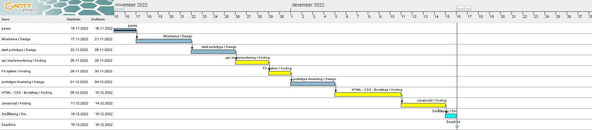

# Auction-House

## Status
[](https://github.com/Thundeee/Auction-House/actions/workflows/pages.yml)
  

## Setup

  

install packages

  

```
npm i
```

  

Build the site

  

```
npm run build
```

  

Launch live server

```
npm run startServer
```

# Planning
## Gantt chart:

## Figma Link:
https://www.figma.com/file/QvtGNgMqpEqLOROA5TaPeI/Untitled?node-id=1%3A3&t=3glEw0VjToiimN11-1
## Kanban Board:
https://github.com/users/Thundeee/projects/3

# Hosting
## Github Pages
https://thundeee.github.io/Auction-House/

# Planned features
## Extra
Extra things i had plans for is displayed on the Kanban Board. Most of these were features I wanted to implement but either got stuck on or didn't have time for.

## Looking back
 My biggest regret this assignment was not making a universal way to handle errors as this would have saved me alot of time and made the finished product much better at displaying errors.

# Note about copyright
In this project I have used a logo I do not have the rights to use. If this was a real project I would of course either made my own logo or got permission to use the logo I would use.